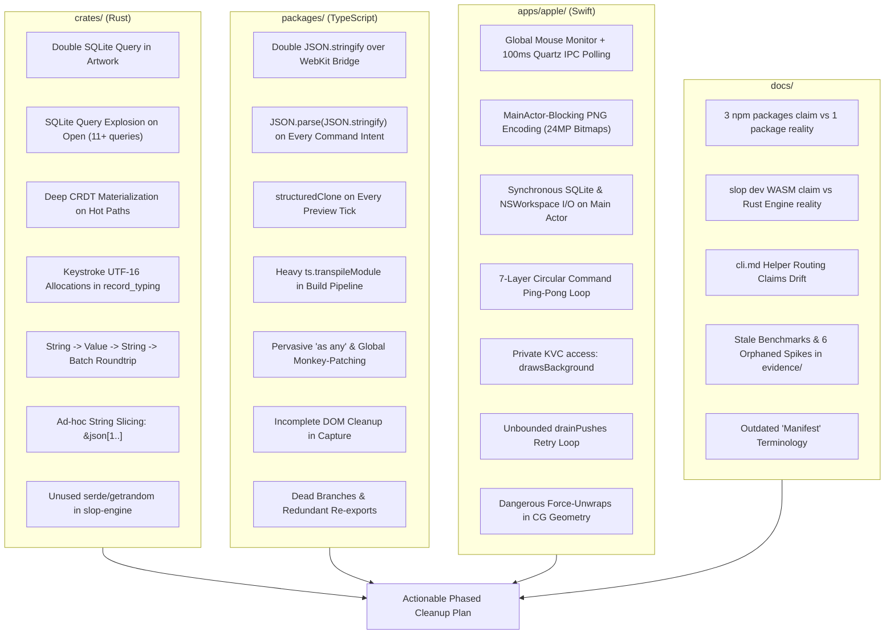

# Comprehensive Code Review & Cleanup Plan: hitSlop

A deep review of **`crates/`**, **`packages/`**, **`apps/apple/`**, and **`docs/`** was conducted to identify architectural complexity, performance bottlenecks, hacky workarounds, and dead code.

---

## 1. Executive Summary & Review Findings



---

## 2. Findings by Layer

### Layer 1: Rust Crates (`crates/`)

#### 1.1 Overly Complicated Architecture
1. **Serialization Churn (`command.rs` lines 267–275, `lib.rs` line 578):**
   In `SocketRequest::Batch`, `ops` is already parsed into a string. The code parses it with `serde_json::from_str::<Value>(&ops)`, wraps it into `json!({"intents": ...})`, adds `base` and `ifVersion`, converts to `.to_string()`, sends it across `mpsc` to `Owner::request(Request::Apply)`, which passes `batch_json: &str` to `apply_batch(&batch_json)`, which immediately executes `parse::<Batch>(&batch)`.
   *Path:* `JSON String` → `serde_json::Value` → `JSON String` → `wire::Batch`.
2. **Descriptor Re-parsing on Every Command (`owner/commands.rs` lines 136–138):**
   `serde_json::from_str::<Value>(app.app.document_json())` parses the full immutable JSON descriptor on *every command run*.
3. **Ad-Hoc JSON Stitching via Substring Slicing (`lib.rs` line 125, `command.rs` line 249):**
   `sequenced()` uses `format!("{{\"sequence\":{sequence},{}", &reading[1..])` and `SocketSuccess::Get` uses `format!("{{\"schema\":...,{}", &json[1..])`. Bypasses structured serialization and assumes JSON strings begin with `{` without whitespace.
4. **Redundant Category & Window Model Layers (`app/package_format_1.rs`, `app/mod.rs`, `hitslop-core-ffi/src/app.rs`):**
   `Category` is duplicated across enum declarations, `CATEGORY_COLUMNS` tuples, and manual parsing methods. Window geometry is mapped across 4 distinct struct definitions.

#### 1.2 Performance Issues
1. **Double Database Query for Artwork (`file/rows.rs` lines 90–103):**
   `read_artwork` queries `SELECT length(png) FROM artwork WHERE name=?`, and immediately queries `SELECT png FROM artwork WHERE name=?` for the exact same row.
2. **SQLite Query Explosion on Document Open (`file/mod.rs` lines 186–205, 418–450):**
   Opening a document runs `summary_on()` (11 queries), `contents()` (10 queries including `PRAGMA quick_check`), and `opened()` which re-scans all asset keys and counts.
3. **Deep CRDT Tree Materialization in Hot Paths (`lib.rs` lines 501–528):**
   `projected()` calls `doc.get_map("data").get_deep_value()`. Materializes the full Loro tree into `LoroValue`, then converts to `serde_json::Value`, then recursively projects whole numbers. Runs on every command run and snapshot read.
4. **Keystroke Allocation Churn (`lib.rs` line 733, `text.rs` lines 52–57, 307):**
   `let (before, after): (Vec<u16>, Vec<u16>) = (from.encode_utf16().collect(), to.encode_utf16().collect());` allocates two vectors on *every single keystroke* in `record_typing`. `text.rs` allocates character vectors and full string clones of Loro text.
5. **Thread Spawning per Connection & Evaluation:**
   `socket.rs` (line 254) spawns an OS thread per client request. `hitslop-runner` (lines 113–133) spawns two OS threads (stdin writer, stdout reader) for every command execution.

#### 1.3 Hacky Code
1. **`unwrap()` and `expect()` in Production Crates:**
   Found across `descriptor.rs` (lines 64–67), `execute.rs` (lines 22, 26, 31, 38, 45, 284), `slop-engine/src/main.rs` (lines 44, 61, 79, 110), and `owner.rs` (line 205).
2. **Magic Constants and Deprecated C APIs in Sandboxing:**
   `F_SETNOSIGPIPE = 73` hardcoded in `hitslop-runner/src/lib.rs:163`. `sandbox_init` private macOS function in `sandbox.rs`.
3. **Silent Buffer Truncation in Socket Streaming (`socket.rs` lines 83–91):**
   Discards leftover bytes after `\n` in multi-message buffers.

#### 1.4 Dead Code
1. **Unused Dependencies in `crates/slop-engine/Cargo.toml`:**
   `serde.workspace = true` and `getrandom = "0.2"` are completely unused in `slop-engine`.
2. **`#[allow(dead_code)]` in Wire Types (`wire/socket.rs` line 177):**
   Unread `ok: True` in `HelloSuccess`.
3. **Orphaned Example:**
   `crates/hitslop-core/examples/bench_replace.rs` is not declared under `[[example]]` in `Cargo.toml`.

---

### Layer 2: TypeScript Packages (`packages/hitslop/`)

#### 2.1 Overly Complicated Architecture
1. **5-Layer Indirection for Reactive Reads:**
   `defineDocument` getter -> `live().current` -> `context.ts` active singleton -> `store.svelte.ts` raw state -> `abi/1.ts` -> `OwnerDocument.current` -> `previews.overlay()`.
2. **Framework Leak via Side-Channel Observer (`document.ts` line 47, `store.svelte.ts` line 60):**
   `OwnerDocument` invokes `this.observer()` on every read to trigger a dummy read of `$state.raw(current)` in Svelte 5.
3. **Heavyweight Build Transforms (`command-transform.ts`, `definition-build.ts`):**
   `ts.transpileModule` full TypeScript AST parsing runs on every source file to strip command bodies. Builds run Vite twice sequentially.

#### 2.2 Performance Issues
1. **Double JSON Serialization across Bridge (`transport.ts` line 27, `bridge.ts` line 10):**
   `batch: JSON.stringify(batch)` is placed inside an outer object that is then `JSON.stringify(request)`-ed again.
2. **Synchronous Deep Cloning on Live Interaction (`commands.ts` line 38, `previews.ts` line 31):**
   `JSON.parse(JSON.stringify(intent))` runs on every command intent. `structuredClone(value)` runs on every preview update (slider drag, typing).
3. **Redundant Tree Walks & String Slicing (`document.ts` line 156, `path.ts` lines 30–33):**
   `mapPaths()` walks the whole document on every preview update. `atOrBeneath` tests path hierarchy via `scope.slice(0, -1) + ","` JSON string slicing.
4. **Artificial 120ms Delay in Preview Capture (`capture.ts` lines 87–94):**
   Unconditionally loops 3 times over `setTimeout(resolve, 40)` (minimum 120ms delay).
5. **Base64 Attachment Chunking (`attachments.ts`, `bridge.ts`):**
   Loads 10MB ArrayBuffers into memory and converts to Base64 in 16KB loops over postMessage.

#### 2.3 Hacky Code
1. **Pervasive `as any` Casts:**
   `(element as any).disabled`, `(globalThis as any).webkit`, `(bytes as any).toBase64()`, `(globalThis as any).Date = RestrictedDate`.
2. **Global Monkey-Patching in `runner-1.ts`:**
   Proxies global `Date`, mutates `OriginalDate.prototype.constructor`, and overwrites `Math.random`.
3. **Incomplete DOM Cleanup in `capture.ts` (lines 100–112, 163–177):**
   Injected `<span>` replacements are never removed and hidden input fields are never restored in `restore()`.
4. **Undocumented Magic Timeouts:**
   `settleMS = 150`, `stallMS = 2000`, `12_000ms` font timeout, `15_000ms` preview timeouts.

#### 2.4 Dead Code
1. **Redundant Dependency:** `"svelte-check"` in `packages/hitslop/package.json` direct dependencies.
2. **Dead Policy Branch:** `appContentSecurityPolicy("native")` in `src/schema/policy.ts:3-4` is never called.
3. **Redundant File:** `src/schema/values.ts` only re-exports two types from `engine.generated.ts`.
4. **Protocol Mismatch:** `src/shell/boot.js` sends raw JS object to `postMessage` instead of JSON string.

---

### Layer 3: Apple Swift Host (`apps/apple/`)

#### 3.1 Overly Complicated Architecture
1. **7-Layer Circular Command Ping-Pong:**
   Toolbar click (`SlopToolbar`) -> `SlopHoverToolbar` -> `SlopDocumentWindowController` -> `DocumentWindows` -> `AppModel` (`CommandQueue`) -> `client.perform` -> `SlopDocumentWindowController.perform` -> `session.copy()`.
2. **Unbounded Retry Loop in `drainPushes` (`DocumentSession.swift:192-228`):**
   `while true` loop with 2000ms backoff; if WebKit script evaluation fails, loops indefinitely and blocks new drain tasks.
3. **Fragile Window Close / Capture State Machine:**
   Unwinding `prepareClose()`, `cancelPreparedClose()`, and handling export conflicts across multi-stage phase flags.
4. **Three Independent Floating `NSPanel` Objects:**
   Toolbar, theme panel, and issue badge are separate panels linked via manual coordinate sync and `addChildWindow`.

#### 3.2 Performance Issues
1. **Global Mouse Monitor + Quartz WindowServer IPC (`SlopToolbarInteraction.swift:85-153`):**
   Installs `NSEvent.addGlobalMonitorForEvents` across the entire OS. Triggers repeating 100ms timer calling `NSWindow.windowNumber(at:belowWindowWithWindowNumber:)` (synchronous WindowServer IPC) and reading uncached bitmap alpha masks.
2. **MainActor-Blocking PNG Encoding (`SlopPreviewImage.swift:7-35`):**
   Encodes up to 24-megapixel bitmaps to PNG synchronously on `@MainActor`, blocking UI for 400ms – 2.5s.
3. **Synchronous Disk I/O on `@MainActor`:**
   `SlopArtwork.first` (SQLite query) and `NSWorkspace.shared.setIcon` run on the main thread during `copy()`, `create()`, and `finishClose()`.
4. **Duplicate Window Layout Passes (`SlopWindow.swift:297-303`):**
   `setFrame` synchronously triggers `windowDidResize`, causing `toolbar.relayout()` and `layoutThemePanel()` to execute twice.

#### 3.3 Hacky Code
1. **Private KVC on `WKWebView` (`DocumentSession.swift:723-730`):**
   `view.value(forKey: "drawsBackground")` and `view.setValue(value, forKey: "drawsBackground")`. (Can be replaced with `view.underPageBackgroundColor = .clear`).
2. **Modal Event-Tracking Loop (`SlopToolbarInteraction.swift:58-71`):**
   `while let next = nextEvent(matching: ... inMode: .eventTracking)` runs a blocking loop inside `sendEvent`.
3. **Dangerous Force-Unwraps in Geometry:**
   `source.copy(using: &transform)!`, `path.copy()!`, and un-guarded `horizontal[3]` indexing in `SlopSilhouette.swift` / `SlopWindowMask.swift`.
4. **Hidden 1×1 Dummy Button in SwiftUI (`CatalogView.swift:44-48`):**
   Uses an invisible 1×1 button for `⌘K` shortcut.

#### 3.4 Dead Code
1. **Leftover Intermediate Library:**
   `apps/apple/Packages/HitSlopApple/Generated/libhitslop_core_ffi.a` is not referenced by `Package.swift` (which links `HitSlopCoreFFI.xcframework`).
2. **Unreachable Code:** Dead `else` branch in `CatalogView.swift` `BrandLink`.

---

### Layer 4: Documentation (`docs/`)

#### 4.1 Outdated Architecture & Drift
1. **"Three npm packages" vs. Single `hitslop` package:**
   Contradictions in `development.md:33`, `engineering-contract.md:46`, `testing.md:18` vs reality in `package.json` and `releasing.md`.
2. **`slop dev` Engine Claim:**
   `crates/README.md` claims `slop dev` runs on WASM, while `AGENTS.md`, `architecture.md`, and code prove it uses the native Rust engine.
3. **CLI Helper Routing Claims:**
   `docs/guides/cli.md` claims `register` and `build --artwork native` are passed to the helper, but the engine only routes `open`, `screenshot`, and `export`.
4. **Outdated "Manifest" Terminology:**
   Lingering references to "manifest" in `ideas.md:149`, `Cargo.toml:29`, `limits.rs:35`.

#### 4.2 Stale Benchmarks & Orphaned Evidence
1. **Outdated Benchmarks in `architecture.md:392-398`:**
   Cites late September benchmark files created prior to single-file SQLite database and QuickJS child runner.
2. **Orphaned Evidence Files to Archive:**
   `browser-storage-2026-10-06.*`, `marker-drill-2026-10-06.*`, `native-dev-owner.*`, `one-package-install-2026-10-06.md`, `packaging-integration.md`, `theme-drag-2026-10-04.json`.

---

## 3. Prioritized Phased Cleanup Plan

### Phase 1: Quick Wins — Dead Code & Dependency Hygiene
*Risk: Zero | Complexity: Low*

1. **Rust Crates Hygiene:**
   - In `crates/slop-engine/Cargo.toml`, remove unused `serde` and `getrandom` dependencies.
   - In `crates/hitslop-core/src/wire/socket.rs`, replace `#[allow(dead_code)] ok: super::engine::True` with `_ok`.
   - In `crates/hitslop-core/Cargo.toml`, add `[[example]] name = "bench_replace"` to avoid untracked example warning.
2. **Package Hygiene:**
   - In `packages/hitslop/src/schema/policy.ts`, remove the dead `environment === "native"` branch.
   - Inline `packages/hitslop/src/schema/values.ts` into its consumers and remove the file.
   - In `packages/hitslop/package.json`, remove redundant `"svelte-check"` dependency.
3. **Apple Target Hygiene:**
   - In `apps/apple/Packages/HitSlopApple/Generated/`, remove loose `libhitslop_core_ffi.a` (retaining `HitSlopCoreFFI.xcframework`).
   - In `CatalogView.swift:165-175`, remove the dead `else` branch in `BrandLink`.
4. **Documentation Hygiene:**
   - Update `docs/guides/development.md`, `docs/engineering-contract.md`, and `docs/testing.md` to reference the single `hitslop` npm package.
   - Correct `crates/README.md` to state that `slop dev` uses `slop-engine --preview-owner` natively.
   - Correct `docs/guides/cli.md` helper routing section.
   - Move 6 orphaned evidence files from `docs/evidence/` to `archive/docs/evidence/`.

---

### Phase 2: High-Impact Performance Fixes
*Risk: Low | Complexity: Medium*

1. **Apple: Remove Global Mouse Monitor & Quartz IPC Overhead:**
   - In `HitSlopHost/SlopToolbarInteraction.swift`:
     - Eliminate `NSEvent.addGlobalMonitorForEvents` and the 100ms repeating timer.
     - Rely on `NSTrackingArea` on `ShapedView` / window content view and window focus events (`NSWindow.didBecomeKeyNotification`, `mouseEntered`, `mouseExited`).
     - Eliminates hundreds of synchronous Quartz WindowServer IPC calls per minute and eliminates bitmap alpha reading while hitSlop is in the background.
2. **Apple: Offload PNG Encoding from `@MainActor`:**
   - In `HitSlopHost/SlopPreviewImage.swift`:
     - Offload `NSBitmapImageRep.representation(using: .png)` from the main thread using `Task.detached(priority: .userInitiated)` or CoreGraphics `CGImageDestination`.
     - Prevents main thread hangs (up to 2.5s) during 24MP exports.
3. **Rust: Eliminate Redundant SQLite Queries:**
   - In `crates/hitslop-core/src/file/rows.rs:90-103`:
     - Delete `SELECT length(png) FROM artwork WHERE name=?`. Read `png` in a single query and check length in memory.
   - In `crates/hitslop-core/src/file/mod.rs`:
     - Consolidate count checks in `contents()` and `summary_on()`. Avoid double-scanning asset keys in `opened()`.
4. **Rust: Eliminate Keystroke Allocations:**
   - In `crates/hitslop-core/src/lib.rs:733`:
     - Compare UTF-16 code units via an iterator instead of allocating two `Vec<u16>` on every keystroke in `record_typing`.
5. **Packages: Eliminate Double JSON Stringify & Synchronous Intent Clones:**
   - In `packages/hitslop/src/shell/owner/transport.ts` and `bridge.ts`:
     - Pass the raw `batch` object instead of pre-stringifying `batch: JSON.stringify(batch)` inside an outer `JSON.stringify(request)`.
   - In `packages/hitslop/src/shell/commands.ts:38`:
     - Replace `JSON.parse(JSON.stringify(intent))` with shallow/structured cloning.
   - In `packages/hitslop/src/shell/owner/store.ts:147`:
     - Stop calling `utf8.encode(JSON.stringify(push))` on every push. Count push items or approximate payload size.

---

### Phase 3: Code Cleanliness & Safety Workarounds
*Risk: Low | Complexity: Medium*

1. **Apple: Eliminate Private KVC on `WKWebView`:**
   - In `DocumentSession.swift:723-730` and `SlopRenderer.swift`:
     - Replace `view.setValue(false, forKey: "drawsBackground")` with `view.underPageBackgroundColor = .clear` and `view.isOpaque = false`.
     - Eliminates private API App Store review risk.
2. **Apple: Geometry Safety & Force-Unwrap Elimination:**
   - In `SlopSilhouette.swift:53` and `SlopWindowMask.swift:143`:
     - Replace `source.copy(using: &transform)!` with `guard let copy = source.copy(using: &transform) else { return source }`.
     - Add guard `horizontal.count >= 4 && vertical.count >= 4` before indexed access.
3. **Apple: Bound Push Drain Retries:**
   - In `DocumentSession.swift:196-228`:
     - Add maximum retry count (e.g. 5 attempts) to `drainPushes()`. Abort retry loop immediately if `phase` is `.closing` or `.closed`.
4. **Packages: Capture DOM Cleanup:**
   - In `packages/hitslop/src/shell/capture.ts:100-112, 163-177`:
     - In `restore()`, remove injected `<span>` replacements and restore `input.style.display`.
5. **Packages: Remove Pervasive `as any`:**
   - Replace `(element as any).disabled` with `"disabled" in element` narrowing.
   - Add proper `declare global` types for `webkit.messageHandlers.hitslop`.
6. **Rust: Structured Replacement for `&json[1..]` Hacks:**
   - Replace string-slicing JSON hacks in `lib.rs:125` and `command.rs:249` with a structured `Serialize` wrapper using `#[serde(flatten)]`.

---

### Phase 4: Architectural Simplification (Medium-Term)
*Risk: Medium | Complexity: High*

1. **Apple: Flatten 7-Layer Command Ping-Pong Loop:**
   - Simplify window actions (`export`, `duplicate`, `theme`) so `SlopDocumentWindowController` can invoke self-contained operations directly, reserving `CommandQueue` for coordinating global multi-window mutations.
2. **Rust: Direct Batch Parsing in Socket Requests:**
   - In `crates/hitslop-core/src/command.rs`, parse `ops` directly into `wire::Batch` instead of passing through intermediate untyped `serde_json::Value` and re-serializing to string.
3. **Rust: Cache Parsed Descriptor in `AppDefinition`:**
   - In `OpenedApp` / `AppDefinition`, store the parsed descriptor `serde_json::Value` once at open time rather than re-parsing it from string on every command run.
4. **Packages: Replace `ts.transpileModule` in Build Pipeline:**
   - Replace heavyweight TypeScript compiler API in `command-transform.ts` and `asset-url-transform.ts` with Vite / Rolldown plugin AST hooks or lightweight regex/lexer.

---

## 4. Verification Plan

### Automated Tests
Run workspace verification tiers after each phase:
```sh
# Verify contracts and TypeScript types
bun run check

# Verify Rust crates (all targets, clippy, unit and integration tests)
bun run core:test

# Verify Swift package tests
bun run swift:test

# Run full project verification
bun run verify
```

### Manual Verification
1. **Window Performance & Idle CPU:**
   - Open hitSlop with multiple windows (e.g., Quick Checklist, Hourglass, Shape Lab).
   - In Activity Monitor, verify that hitSlop idle CPU drops to ~0.0% when mouse is moving outside hitSlop windows (confirming removal of global mouse monitor IPC).
2. **Large Export:**
   - Open a document, trigger PNG export at maximum resolution.
   - Confirm main thread remains responsive (toolbar buttons hover and click smoothly) during export rendering.
3. **Theme & Drags:**
   - Open theme editor and drag color pickers; confirm smooth 60fps palette updates without dropped frames.
4. **CLI Operations:**
   - Run `bun run slop check examples/slops/quick-checklist`.
   - Run `bun run slop build examples/slops/quick-checklist`.
   - Run `bun run slop dev examples/slops/quick-checklist` and verify hot reload and command evaluation.
